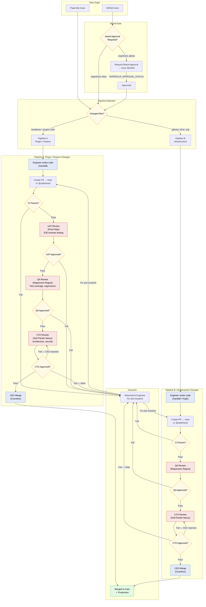
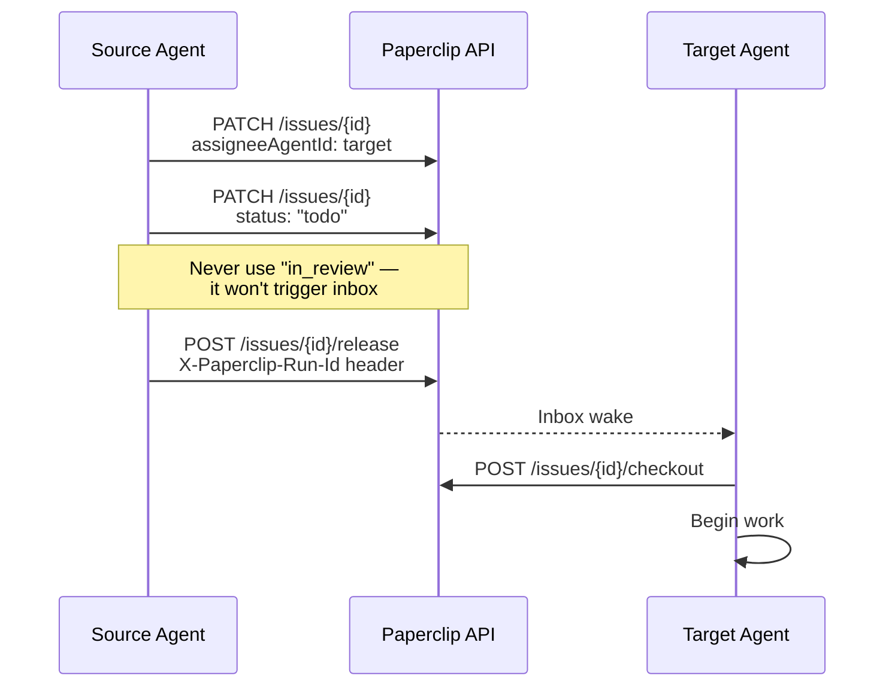
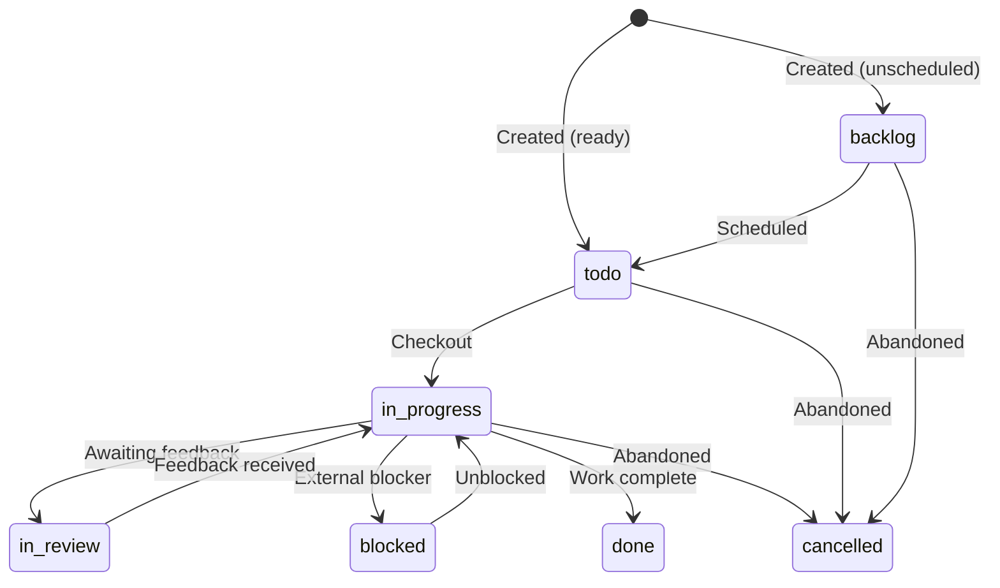

# SDLC Pipeline Diagram

## Full Lifecycle

```mermaid
flowchart TD
    subgraph Origin["Task Origin"]
        GH["GitHub Issue"]
        PP["Paperclip Issue"]
    end

    subgraph Approval["Board Gate"]
        BA{"Board Approval<br/>Required?"}
        REQ["Request Board Approval<br/>→ Issue blocked"]
        APPROVED["Approved"]
    end

    subgraph Detection["Pipeline Detection"]
        DET{"Changed files?"}
        PA["Pipeline A<br/>Plugin / Feature"]
        PB["Pipeline B<br/>Infrastructure"]
    end

    subgraph PipelineA["Pipeline A: Plugin / Feature Changes"]
        direction TB
        A_ENG["Engineer writes code<br/>(Gandalf)"]
        A_PR["Create PR → main<br/>cc @cpfarhood"]
        A_CI{"CI Passes?"}
        A_UAT["UAT Review<br/>(Pixel Patty)<br/>E2E browser testing"]
        A_UAT_PASS{"UAT Approved?"}
        A_QA["QA Review<br/>(Regression Regina)<br/>Test coverage, regressions"]
        A_QA_PASS{"QA Approved?"}
        A_CTO["CTO Review<br/>(Null Pointer Nancy)<br/>Architecture, security"]
        A_CTO_PASS{"CTO Approved?"}
        A_CEO["CEO Merge<br/>(Countess)"]
    end

    subgraph PipelineB["Pipeline B: Infrastructure Changes"]
        direction TB
        B_ENG["Engineer writes code<br/>(Gandalf / Hugh)"]
        B_PR["Create PR → main<br/>cc @cpfarhood"]
        B_CI{"CI Passes?"}
        B_QA["QA Review<br/>(Regression Regina)"]
        B_QA_PASS{"QA Approved?"}
        B_CTO["CTO Review<br/>(Null Pointer Nancy)"]
        B_CTO_PASS{"CTO Approved?"}
        B_CEO["CEO Merge<br/>(Countess)"]
    end

    subgraph Result["Outcome"]
        MERGED["Merged to main<br/>✓ Production"]
        RETURNED["Returned to Engineer<br/>Fix and resubmit"]
    end

    %% Origin routing
    GH --> BA
    PP --> DET
    BA -->|"originKind: github"| REQ
    REQ -->|"PAPERCLIP_APPROVAL_STATUS"| APPROVED
    BA -->|"originKind: other"| DET
    APPROVED --> DET

    %% Pipeline detection
    DET -->|"headlamp-*-plugin/ code"| PA
    DET -->|".github/, infra/, org/"| PB

    %% Pipeline A flow
    PA --> A_ENG --> A_PR --> A_CI
    A_CI -->|"Pass"| A_UAT
    A_CI -->|"Fail"| RETURNED
    A_UAT --> A_UAT_PASS
    A_UAT_PASS -->|"Pass"| A_QA
    A_UAT_PASS -->|"Fail"| RETURNED
    A_QA --> A_QA_PASS
    A_QA_PASS -->|"Pass"| A_CTO
    A_QA_PASS -->|"Fail"| RETURNED
    A_CTO --> A_CTO_PASS
    A_CTO_PASS -->|"Pass"| A_CEO
    A_CTO_PASS -->|"Fail — CEO rejection"| A_CTO
    A_CTO_PASS -->|"Fail — other"| RETURNED
    A_CEO --> MERGED

    %% Pipeline B flow
    PB --> B_ENG --> B_PR --> B_CI
    B_CI -->|"Pass"| B_QA
    B_CI -->|"Fail"| RETURNED
    B_QA --> B_QA_PASS
    B_QA_PASS -->|"Pass"| B_CTO
    B_QA_PASS -->|"Fail"| RETURNED
    B_CTO --> B_CTO_PASS
    B_CTO_PASS -->|"Pass"| B_CEO
    B_CTO_PASS -->|"Fail — CEO rejection"| B_CTO
    B_CTO_PASS -->|"Fail — other"| RETURNED
    B_CEO --> MERGED

    RETURNED -->|"Fix and resubmit"| A_PR
    RETURNED -->|"Fix and resubmit"| B_PR

    %% Styling
    classDef gate fill:#f9e4e4,stroke:#c0392b,color:#000
    classDef pass fill:#e4f9e4,stroke:#27ae60,color:#000
    classDef agent fill:#e4e9f9,stroke:#2980b9,color:#000
    classDef decision fill:#fef9e7,stroke:#f39c12,color:#000

    class BA,A_CI,A_UAT_PASS,A_QA_PASS,A_CTO_PASS,B_CI,B_QA_PASS,B_CTO_PASS,DET decision
    class A_UAT,A_QA,A_CTO,B_QA,B_CTO gate
    class MERGED pass
    class A_ENG,B_ENG,A_CEO,B_CEO agent
```

## PR Review SLA

```mermaid
gantt
    title PR Review SLA Timeline (per stage)
    dateFormat X
    axisFormat %d h

    section SLA Windows
    Normal review window   :done, 0, 24
    CEO escalation at 24h  :active, 24, 48
    SLA violation at 48h   :crit, 48, 72
    Release blocker at 72h :crit, 72, 96
```

## Handoff Protocol

```mermaid
sequenceDiagram
    participant Src as Source Agent
    participant API as Paperclip API
    participant Tgt as Target Agent

    Src->>API: PATCH /issues/{id}<br/>assigneeAgentId: target
    Src->>API: PATCH /issues/{id}<br/>status: "todo"
    Note over Src,API: Never use "in_review" —<br/>it won't trigger inbox
    Src->>API: POST /issues/{id}/release<br/>X-Paperclip-Run-Id header
    API-->>Tgt: Inbox wake
    Tgt->>API: POST /issues/{id}/checkout
    Tgt->>Tgt: Begin work
```

## Issue Status Lifecycle

```mermaid
stateDiagram-v2
    [*] --> backlog: Created (unscheduled)
    [*] --> todo: Created (ready)
    backlog --> todo: Scheduled
    todo --> in_progress: Checkout
    in_progress --> in_review: Awaiting feedback
    in_progress --> blocked: External blocker
    in_progress --> done: Work complete
    in_review --> in_progress: Feedback received
    blocked --> in_progress: Unblocked
    in_progress --> cancelled: Abandoned
    todo --> cancelled: Abandoned
    backlog --> cancelled: Abandoned
```
