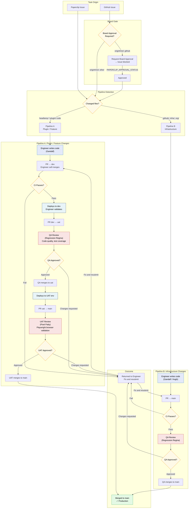
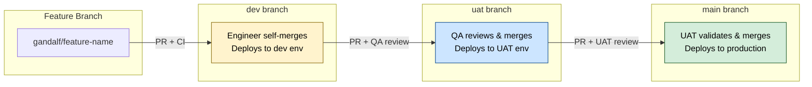

# SDLC Pipeline Diagram

## Full Lifecycle

```mermaid
flowchart TD
    subgraph Origin["Task Origin"]
        GH["GitHub Issue"]
        PP["Paperclip Issue"]
    end

    subgraph Approval["Board Gate"]
        BA{"Board Approval<br/>Required?"}
        REQ["Request Board Approval<br/>→ Issue blocked"]
        APPROVED["Approved"]
    end

    subgraph Detection["Pipeline Detection"]
        DET{"Changed files?"}
        PA["Pipeline A<br/>Plugin / Feature"]
        PB["Pipeline B<br/>Infrastructure"]
    end

    subgraph PipelineA["Pipeline A: Plugin / Feature Changes"]
        direction TB
        A_ENG["Engineer writes code<br/>(Gandalf)"]
        A_PR_DEV["PR → dev<br/>Engineer self-merges"]
        A_CI_DEV{"CI Passes?"}
        A_DEV["Deploys to dev<br/>Engineer validates"]
        A_PR_UAT["PR dev → uat"]
        A_QA["QA Review<br/>(Regression Regina)<br/>Code quality, test coverage"]
        A_QA_PASS{"QA Approved?"}
        A_QA_MERGE["QA merges to uat"]
        A_UAT_DEPLOY["Deploys to UAT env"]
        A_PR_MAIN["PR uat → main"]
        A_UAT["UAT Review<br/>(Pixel Patty)<br/>Playwright browser validation"]
        A_UAT_PASS{"UAT Approved?"}
        A_UAT_MERGE["UAT merges to main"]
    end

    subgraph PipelineB["Pipeline B: Infrastructure Changes"]
        direction TB
        B_ENG["Engineer writes code<br/>(Gandalf / Hugh)"]
        B_PR["PR → main"]
        B_CI{"CI Passes?"}
        B_QA["QA Review<br/>(Regression Regina)"]
        B_QA_PASS{"QA Approved?"}
        B_QA_MERGE["QA merges to main"]
    end

    subgraph Result["Outcome"]
        PROD["Merged to main<br/>✓ Production"]
        RETURNED["Returned to Engineer<br/>Fix and resubmit"]
    end

    %% Origin routing
    GH --> BA
    PP --> DET
    BA -->|"originKind: github"| REQ
    REQ -->|"PAPERCLIP_APPROVAL_STATUS"| APPROVED
    BA -->|"originKind: other"| DET
    APPROVED --> DET

    %% Pipeline detection
    DET -->|"headlamp-*-plugin/ code"| PA
    DET -->|".github/, infra/, org/"| PB

    %% Pipeline A flow
    PA --> A_ENG --> A_PR_DEV --> A_CI_DEV
    A_CI_DEV -->|"Pass"| A_DEV
    A_CI_DEV -->|"Fail"| RETURNED
    A_DEV --> A_PR_UAT --> A_QA --> A_QA_PASS
    A_QA_PASS -->|"Approved"| A_QA_MERGE --> A_UAT_DEPLOY
    A_QA_PASS -->|"Changes requested"| RETURNED
    A_UAT_DEPLOY --> A_PR_MAIN --> A_UAT --> A_UAT_PASS
    A_UAT_PASS -->|"Approved"| A_UAT_MERGE --> PROD
    A_UAT_PASS -->|"Changes requested"| RETURNED

    %% Pipeline B flow
    PB --> B_ENG --> B_PR --> B_CI
    B_CI -->|"Pass"| B_QA --> B_QA_PASS
    B_CI -->|"Fail"| RETURNED
    B_QA_PASS -->|"Approved"| B_QA_MERGE --> PROD
    B_QA_PASS -->|"Changes requested"| RETURNED

    RETURNED -->|"Fix and resubmit"| A_PR_DEV
    RETURNED -->|"Fix and resubmit"| B_PR

    %% Styling
    classDef gate fill:#f9e4e4,stroke:#c0392b,color:#000
    classDef pass fill:#e4f9e4,stroke:#27ae60,color:#000
    classDef agent fill:#e4e9f9,stroke:#2980b9,color:#000
    classDef decision fill:#fef9e7,stroke:#f39c12,color:#000
    classDef deploy fill:#e8f4f8,stroke:#2c3e50,color:#000

    class BA,A_CI_DEV,A_QA_PASS,A_UAT_PASS,B_CI,B_QA_PASS,DET decision
    class A_QA,A_UAT,B_QA gate
    class PROD pass
    class A_ENG,B_ENG agent
    class A_DEV,A_UAT_DEPLOY deploy
```

## Branch Promotion Chain

```mermaid
flowchart LR
    subgraph Feature["Feature Branch"]
        FB["gandalf/feature-name"]
    end

    subgraph Dev["dev branch"]
        DEV["Engineer self-merges<br/>Deploys to dev env"]
    end

    subgraph UAT["uat branch"]
        UATB["QA reviews & merges<br/>Deploys to UAT env"]
    end

    subgraph Main["main branch"]
        MAIN["UAT validates & merges<br/>Deploys to production"]
    end

    FB -->|"PR + CI"| DEV
    DEV -->|"PR + QA review"| UATB
    UATB -->|"PR + UAT review"| MAIN

    classDef dev fill:#fff3cd,stroke:#856404,color:#000
    classDef uat fill:#cce5ff,stroke:#004085,color:#000
    classDef prod fill:#d4edda,stroke:#155724,color:#000

    class DEV dev
    class UATB uat
    class MAIN prod
```

